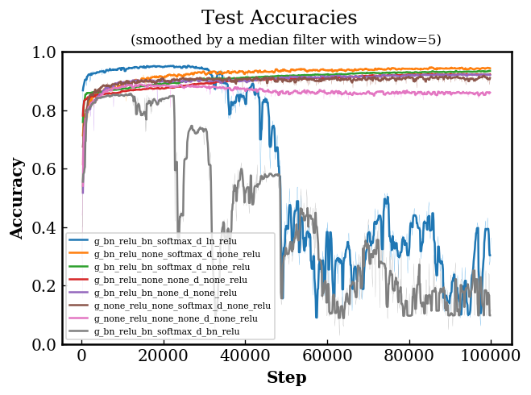

# MNIST Digit Classification with DANs in TensorFlow

In this project, we train a discriminative adversarial network (DAN) to classify
MNIST handwritten digit. We experimentally compare different normalization
approaches, activation functions and training objectives.

## Dicriminative Adversarial Networks (DANs)

The discriminative adversarial network (DAN) is proposed by Mirza _et al._ as a
discriminative framework for learning loss functions for semi-supervised
learning [1]. It is based on the generative adversarial networks (GANs) [1] and
the conditional generative adversarial networks (GANs). However, the generator
now becomes a predictor that take as input an unlabeled data and predict its
label. The discriminator take as input either a real-data-real-label pair
(__x__, __y__) or a real-data-fake-label pair (__x__, G(__x__)) and aim to tell
the fake ones from the real ones.

  

Unlike a typical traditional supervised training scenario, where we need to pick
a specific surrogate loss function as the objective of the predictor to learn
the distribution _p_(__y__|__x__), in DANs the discriminator provides the
critics for the predictor. Hence, _the generator is not optimizing any specific
form of surrogate loss function_ for the discriminator is being optimized along
the training process.

## Results

___More experimental results and analysis are available [here](results).___

In the following tables, we report the highest accuracy on the test set that the
model have achieved during the training.

| Model   | G (hidden norm) | G (out norm) | G (out act) | D (norm) | Accuracy |
|:-------:|:---------------:|:------------:|:-----------:|:--------:|:--------:|
| WGAN-GP | BN              | BN           | softmax     | LN       | 0.9557   |
| WGAN-GP | BN              | X            | softmax     | X        | 0.9489   |
| WGAN-GP | BN              | BN           | softmax     | X        | 0.9353   |
| WGAN-GP | BN              | X            | X           | X        | 0.9253   |
| WGAN-GP | BN              | BN           | X           | X        | 0.9252   |
| WGAN-GP | X               | X            | softmax     | X        | 0.9218   |
| WGAN-GP | X               | X            | X           | X        | 0.8914   |
| WGAN-GP | BN              | BN           | softmax     | BN       | 0.8615   |

_Objectives_&mdash;__GAN__: non-saturating GAN; __WGAN__: Wasserstein GAN with
weight clipping; __WGAN-GP__: Wasserstein GAN with gradient penalties.
_Normalizations_&mdash;__BN__: batch normalization; __LN__: layer normalization.

  

## Reference

[1] Cicero Nogueira dos Santos, Kahini Wadhawan, and Bowen Zhou,
    "Learning Loss Functions for Semi-supervised Learning via Discriminative
    Adversarial Networks,"
    in _NIPS Workshop on Learning with Limited Labeled Data_, 2017.
