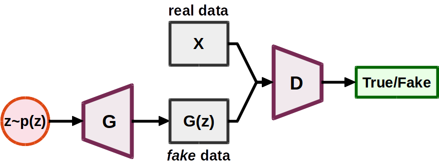
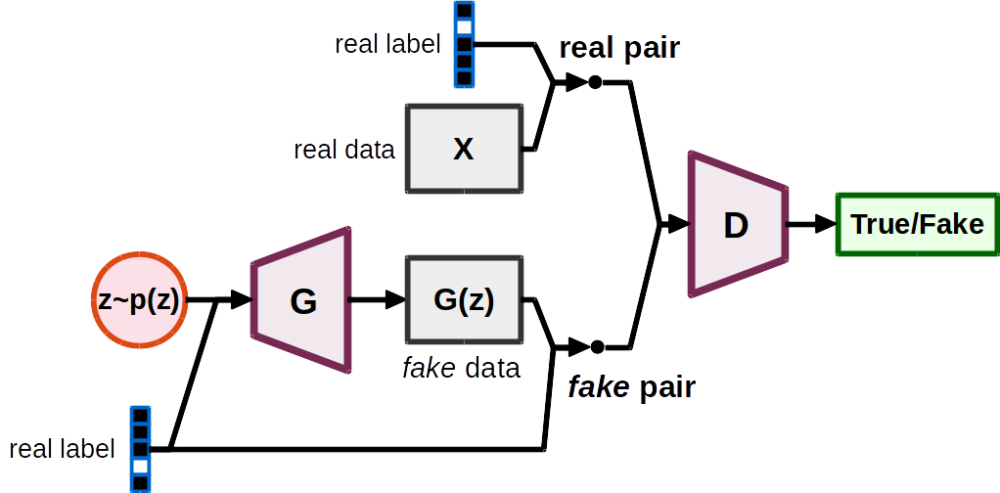

# Background

## Generative Adversarial Network (GAN)

A GAN consists of two networks: a _generator_ network 𝐺 and a discriminator
network 𝐷 [1]. The generator 𝐺 takes as input a random noise 𝐳 sampled from a
prior distribution 𝑝𝐳 and output a fake sample 𝐺(𝐳). The
discriminator 𝐷 takes as input either a sample drawn from real data or generated
by the generator and outputs a scalar indicating its authenticity.

The adversarial setting goes like this:

- __𝐷 tries to tell the fake samples from samples data__
- __𝐺 tries to fool 𝐷 (to make 𝐷 misclassify the generated, fake samples as
  real ones)__

In general, most GAN loss functions proposed in the literature take the
following form:

𝑚𝑎𝑥𝐷 𝔼𝐱~𝑝𝑑 [ 𝑓(𝐷(𝐱)) ] +
𝔼𝐱~𝑝𝑔 [ 𝑔(𝐷(𝐱)) ]

𝑚𝑖𝑛𝐺 𝔼𝐱~𝑝𝑔[ ℎ(𝐷(𝐱)) ]

Here, 𝑓, 𝑔 and ℎ are real functions defined on the data space (i.e., 𝒳 → ℝ),
and we will refer to them as the ___component functions___.

## Conditional Generative Adversarial Networks (CGAN)

In a conditional GAN (CGAN) [2], both the generator 𝐺 and the discriminator 𝐷
are now conditioned on some variable 𝐲. Typical (𝐱, 𝐲) pairs include (data,
labels), (data, tags), (image, image).

## Gradient penalties

As the discriminator is often found to be too strong to provide reliable
gradients to the generator, one ___regularization approach___ is to use some
gradient penalties to constrain the modeling capability of the discriminator.

Most gradient penalties proposed in the literature take the following form:

𝜆 𝔼𝐱~𝑝𝐱 [ 𝑅( ||∇𝐱 𝐷(𝐱)|| ) ]

Here, the _penalty weight_ 𝜆 ∈ ℝ is a pre-defined constant, and 𝑅(⋅) is a real
function. The distribution 𝑝𝐱 defines where the gradient penalties
are enforced. Note that this term will be added to the loss function as a
_regularization term_ for the discriminator.

Here are some common gradient penalties and their 𝑝𝐱 and 𝑅(⋅).

| gradient penalty type                | 𝑝𝐱 | 𝑅(𝑥) |
|--------------------------------------|:-------------:|:----:|
| coupled gradient penalties [3]       | 𝑝𝑑 + 𝑈[0, 1] (𝑝𝑔 − 𝑝𝑑) | (𝑥 − 𝑘)2 or 𝑚𝑎𝑥(𝑥, 𝑘) |
| local gradient penalties [4]         | 𝑝𝑑 + 𝑐 𝑁[0, 𝐼] | (𝑥 − 𝑘)2 or 𝑚𝑎𝑥(𝑥, 𝑘) |
| R1 gradient penalties [5] | 𝑝𝑑 | 𝑥    |
| R2 gradient penalties [5] | 𝑝𝑔 | 𝑥    |

## Spectral normalization

Spectral normalization [6] is another ___regularization approach___ for GANs. It
normalizes the spectral norm of each layer in a neural network to enforce the
Lipschitz constraints. While the gradient penalties impose a local
regularization, the spectral normalization impose a global regularization on the
discriminator.

## References

[1] Ian J. Goodfellow, Jean Pouget-Abadie, Mehdi Mirza, Bing Xu, David
    Warde-Farley, Sherjil Ozair, Aaron Courville, and Yoshua Bengio,
    "Generative Adversarial Networks,"
    in _Proc. NeurIPS_, 2014.

[2] Mehdi Mirza and Simon Osindero,
    "Conditional Generative Adversarial Nets,"
    _arXiv preprint, arXiv:1411.1784_, 2014.

[3] Ishaan Gulrajani, Faruk Ahmed, Martin Arjovsky, Vincent Dumoulin, and
    Aaron Courville,
    "Improved Training of Wasserstein GANs,"
    in _Proc. NeurIPS_, 2017.

[4] Naveen Kodali, Jacob Abernethy, James Hays, and Zsolt Kira,
    "On Convergence and Stability of GANs,"
    _arXiv preprint, arXiv:1705.07215_, 2017.

[5] Lars Mescheder, Andreas Geiger, and Sebastian Nowozin,
    "Which training methods for GANs do actually converge?"
    in _Proc. ICML_, 2018.

[6] Takeru Miyato, Toshiki Kataoka, Masanori Koyama, and Yuichi Yoshida,
    "Spectral Normalization for Generative Adversarial Networks,"
    in _Proc. ICLR_, 2018.
