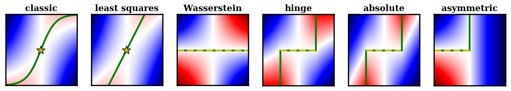

In this project, we aim to gain a deeper understanding of _adversarial losses_
by decoupling the effects of their [_component functions_](background) and
[_regularization terms_](background). In essence, we aim for the following two
research questions:

1. _What certain types of component functions are theoretically valid
   adversarial loss functions?_
2. _How different combinations of the component functions and the regularization
   approaches perform empirically against one another?_

For the first question, we derive some necessary and sufficient conditions of
the component functions such that the adversarial loss is a divergence-like
measure between the data and the model distributions. For more details, please
refer to our paper (_warning: lots of math!_).

For the second question, we propose a new, simple framework called _DANTest_ for
comparing different adversarial losses. With DANTest, we are able to decouple
the effects of component functions and the regularization approaches. In other
words, we would like to know which one of them makes an adversarial loss better
than another. Learn more about the [DANTest](model).
