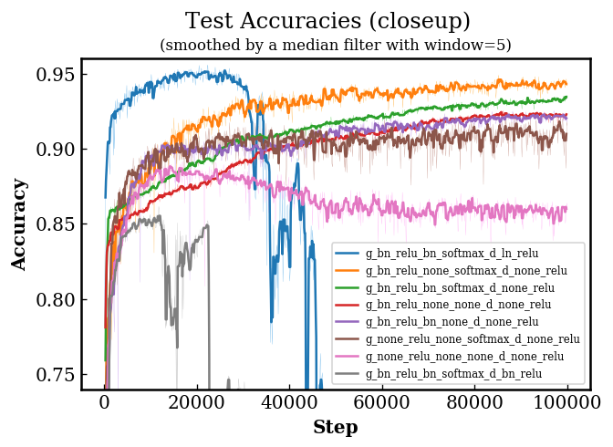
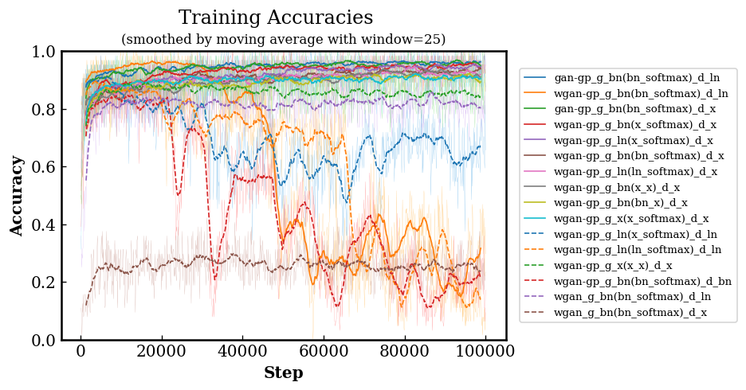
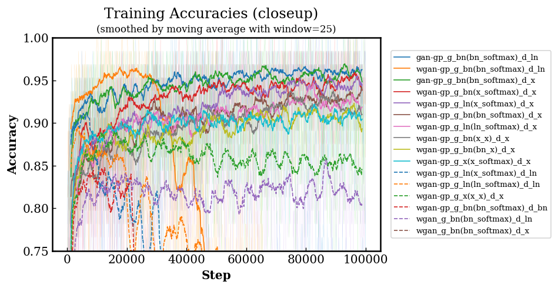
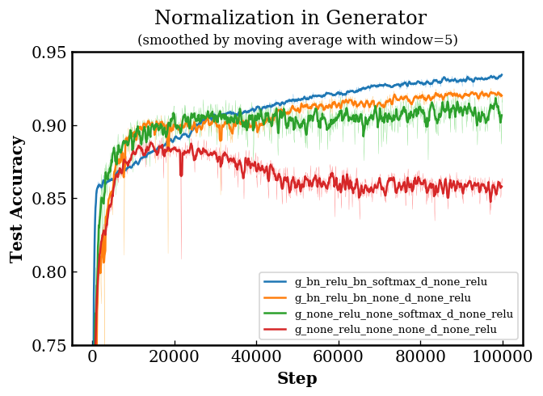
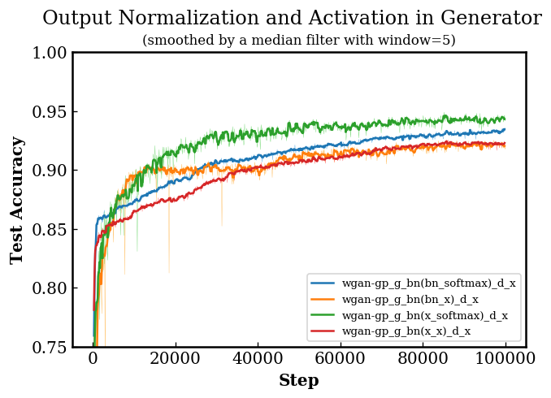
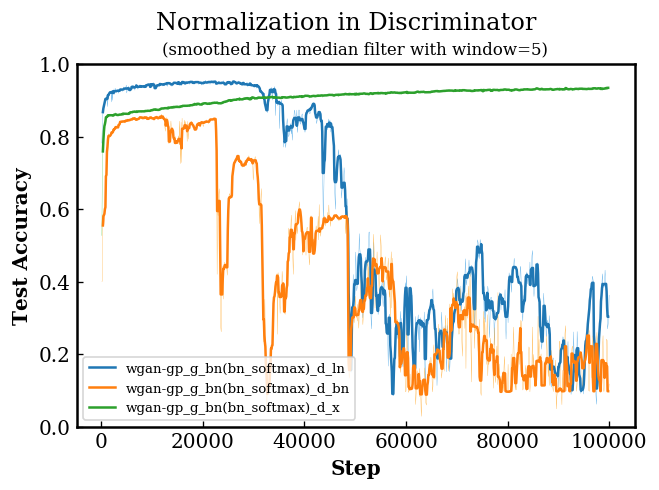

# Results

## Settings

For all the experiments, we used the Adam optimizers and ReLUs as the activation
functions for both the generator and discriminator. Other settings are
summarized in the following table.

| parameter                         | value | &emsp; | parameter       | value |
|:---------------------------------:|:-----:|:------:|:---------------:|:-----:|
| batch size                        | 64    |        | learning rate   | 0.002 |
| number of epochs                  | 20    |        | _β_1 | 0.5   |
| weight clipping threshlod in WGAN | 0.01  |        | _β_2 | 0.9   |
| GP coefficient in WGAN-GP         | 10.0  |        | _ε_             | 1e-8  |

## Full Table of Test Accuracies

_Objectives_&mdash;__GAN__: non-saturating GAN; __WGAN__: Wasserstein GAN with
weight clipping; __WGAN-GP__: Wasserstein GAN with gradient penalties.
_Normalizations_&mdash;__BN__: batch normalization; __LN__: layer normalization.

In the following tables, we report the highest accuracy on the test set that the
model have achieved during the training.

| Model   | G (hidden norm) | G (out norm) | G (out act) | D (norm) | Accuracy |
|:-------:|:---------------:|:------------:|:-----------:|:--------:|:--------:|
| WGAN-GP | BN              | BN           | softmax     | LN       | 0.9557   |
| WGAN-GP | BN              | X            | softmax     | X        | 0.9489   |
| WGAN-GP | BN              | BN           | softmax     | X        | 0.9353   |
| WGAN-GP | BN              | X            | X           | X        | 0.9253   |
| WGAN-GP | BN              | BN           | X           | X        | 0.9252   |
| WGAN-GP | X               | X            | softmax     | X        | 0.9218   |
| WGAN-GP | X               | X            | X           | X        | 0.8914   |
| WGAN-GP | BN              | BN           | softmax     | BN       | 0.8615   |

## Training Accuracies

We also plotted the accuracy for each training batch along the training process.
As we can see from the following two graphs, the training curve has a similar
trend as the corresponding test curve.

## Normalization in Generator

| Model   | G (hidden norm) | G (out norm) | G (out act) | D (norm) | Accuracy |
|:-------:|:---------------:|:------------:|:-----------:|:--------:|:--------:|
| WGAN-GP | BN              | BN           | softmax     | X        | 0.9353   |
| WGAN-GP | BN              | BN           | X           | X        | 0.9252   |
| WGAN-GP | X               | X            | softmax     | X        | 0.9218   |
| WGAN-GP | X               | X            | X           | X        | 0.8914   |

We can see that adopting batch normalization in the generator improves the
performance.

## Output Normalization and Activation in Generator

| Model   | G (hidden norm) | G (out norm) | G (out act) | D (norm) | Accuracy |
|:-------:|:---------------:|:------------:|:-----------:|:--------:|:--------:|
| WGAN-GP | BN              | X            | softmax     | X        | 0.9489   |
| WGAN-GP | BN              | BN           | softmax     | X        | 0.9353   |
| WGAN-GP | BN              | X            | X           | X        | 0.9253   |
| WGAN-GP | BN              | BN           | X           | X        | 0.9252   |

We can see that, for the output layer of the generator, using softmax activation
achieves better performance and that using no normalization performances better
than using batch normalization. Using no normalization with softmax activation
achieves the best performance.

## Normalization in Discriminator

| Model   | G (hidden norm) | G (out norm) | G (out act) | D (norm) | Accuracy |
|:-------:|:---------------:|:------------:|:-----------:|:--------:|:--------:|
| WGAN-GP | BN              | BN           | softmax     | LN       | 0.9557   |
| WGAN-GP | BN              | BN           | softmax     | X        | 0.9353   |
| WGAN-GP | BN              | BN           | softmax     | BN       | 0.8615   |

We can see that for discriminator using layer normalization improves the
performance, while using batch normalization results in a reduction in
performance. We can also see from the following graph that adopting layer
normalization speeds up the training, while the performance might drop
significantly after its highest point.

